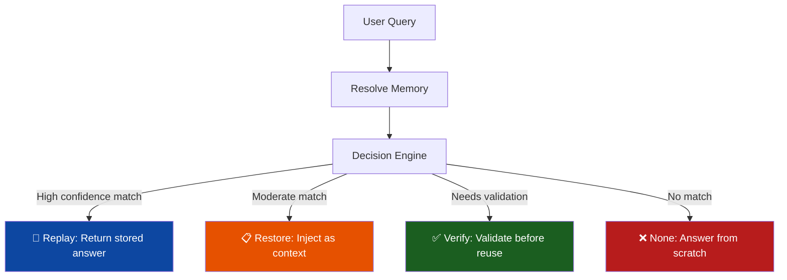
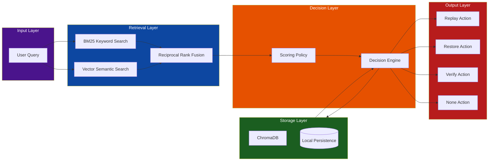
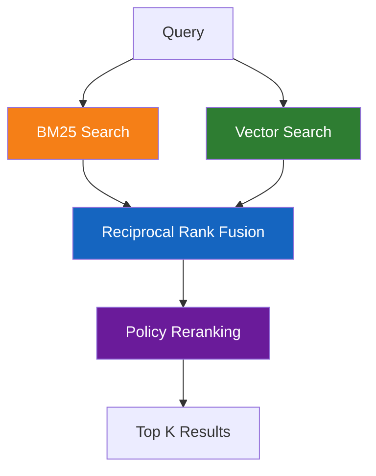

# Agent Memory

[](https://github.com/TheProdSDE/agent-memory-sdk/actions)
[](https://www.python.org/downloads/)
[](https://opensource.org/licenses/MIT)
[](https://pypi.org/project/agent-memory-sdk/)

**Persistent semantic memory for AI agents with intelligent decision-making.**


> **🚀 Created by:** [TheProdSDE](https://github.com/TheProdSDE)

---

## 🎯 The Problem

Most AI memory systems simply retrieve and inject past context into every prompt. This leads to:
- **💰 Higher token costs** - Unnecessary context in every query
- **🎭 Inconsistent responses** - No validation of stale or incorrect memories
- **⏱️ Poor performance** - Always processing memory, even when irrelevant
- **🤖 No intelligence** - Memory is treated as a dumb cache

## ✨ The Solution

Agent Memory is a **decision layer** that intelligently chooses when and how to use memory:



**Benefits:**
- ✅ **Response consistency** - Reuse proven answers
- ✅ **Lower token usage** - Only inject when beneficial
- ✅ **Faster responses** - Instant replay for repeated queries
- ✅ **Better long-term behavior** - Agents learn when to trust memory

### How it compares

mem0, Zep, Letta, and LangMem answer *"what did we store about this?"*.
Agent Memory also answers **"should I use it, and how much should I trust it?"**
— every `resolve()` returns an explicit action (replay / restore / verify /
none) with a scored, explainable rationale (`decision.explain()`).

The difference shows up on **trap queries**. Given a stored memory
*"What payment methods do you support?"*, a naive top-1 retriever answers
*"Does the platform **support** two-factor authentication?"* with the payment
answer. Agent Memory returns `none`:

```text
action: none
confidence: 0.68
reasons:
  - keyword match
  - below restore threshold
```

Our eval suite includes these adversarial cases and scores **25/25 (100%)**
on both backends — see [measured results](docs/benchmarks.md) with the exact
methodology and reproduce commands. No synthetic baselines.

---

## 🏗️ Architecture



### How It Works

1. **Query Input**: User query enters the system
2. **Hybrid Retrieval**: BM25 (keyword) + Vector (semantic) search with RRF fusion
3. **Policy Scoring**: Multi-factor scoring (semantic + recency + confidence + usage)
4. **Decision Engine**: Intelligently selects the best action
5. **Action Execution**: Returns appropriate response based on decision

---

## 📦 Features

### 🎯 Decision-Based Memory

Memory is **not automatically injected**. Each query results in one of four actions:

| Action | Behavior | Use Case |
|--------|----------|----------|
| **Replay** | Return previous answer | Exact or near-identical queries |
| **Restore** | Inject memory as context | Similar queries needing adaptation |
| **Verify** | Validate before reuse | Facts, workflows, tool outputs |
| **None** | Ignore memory | Unrelated queries |

### 🔍 Hybrid Retrieval Pipeline



**Policy scoring considers:**
- 📊 Semantic + keyword similarity (55% weight)
- 📅 Recency (15% weight)
- ✅ Confidence score (20% weight)
- 🔄 Usage frequency (10% weight)

### 🗄️ Storage Backends

| Backend | Install extra | Retrieval | Best for |
|---------|--------------|-----------|----------|
| `sqlite` *(default)* | *(none)* | FTS5 BM25 + coverage | Zero-setup, fast, exact/near-exact queries |
| `sqlite` + vectors | `[semantic]` | sqlite-vec KNN + FTS5 hybrid | Paraphrase robustness, no server |
| `chromadb` | *(bundled)* | Vector embeddings + BM25 | Existing ChromaDB deployments |
| `redis` | `[redis]` | BM25 (Python-side) | Sub-millisecond reads, shared-state workloads |
| `postgres` | `[postgres]` | tsvector FTS + optional pgvector KNN | Production SQL deployments |

```python
# SQLite (default)
memory = Memory(persist_dir=".agent_memory")

# Redis
memory = Memory(backend="redis", url="redis://localhost:6379/0")

# Postgres
memory = Memory(backend="postgres", dsn="postgresql://user:pw@localhost/mydb")
```

Start Redis or Postgres locally with the included Compose file:

```bash
docker compose -f docker-compose.dev.yml up -d   # starts redis + postgres
```

> **Honesty note:** Without the `[semantic]` extra, sqlite's "semantic" search is lexical.
> Exact and near-exact queries work great; paraphrases with zero shared words need
> `[semantic]` or `chromadb`.

### 🗃️ Structured Memory

Store memories with **type** and **scope** for better organization:

**Memory Types:**
- `conversation` - Chat history
- `fact` - Verifiable information
- `workflow` - Step-by-step processes
- `document` - Long-form content
- `tool_output` - API/tool responses
- `code` - Code snippets
- `summary` - Consolidated memories
- `preference` - User preferences

**Scopes:**
- `session` - Current conversation
- `user` - User-specific
- `project` - Project-specific
- `workspace` - Workspace-wide
- `team` - Team-shared
- `global` - Application-wide

### ⏰ Time-to-Live (TTL)

Automatic expiration with flexible TTL:
```python
# Absolute time
memory.remember(query, response, ttl="30d")  # 30 days
memory.remember(query, response, ttl="2h")   # 2 hours

# Relative time
memory.remember(query, response, ttl=3600)   # 1 hour in seconds
```

### 📊 Observability

Full transparency into decision-making:
```python
decision = memory.resolve(query)
print(decision)  # Decision object
print(decision.explain())  # Detailed score breakdown
```

---

## 🚀 Quick Start

### Installation

```bash
# Core (SQLite backend, MCP server, CLI)
pip install agent-memory-sdk

# With optional extras
pip install "agent-memory-sdk[semantic]"    # vector search: sqlite-vec + fastembed
pip install "agent-memory-sdk[redis]"       # Redis backend
pip install "agent-memory-sdk[postgres]"    # PostgreSQL backend
pip install "agent-memory-sdk[api]"         # FastAPI REST server
pip install "agent-memory-sdk[dashboard]"   # Streamlit dashboard
pip install "agent-memory-sdk[langchain]"   # LangChain BaseMemory adapter
pip install "agent-memory-sdk[llamaindex]"  # LlamaIndex BaseMemory adapter

# From source (development)
git clone https://github.com/TheProdSDE/agent-memory-sdk.git
cd agent-memory-sdk
pip install -e ".[dev]"
```

### Basic Usage

```python
from agent_memory import Memory, MemoryAction, MemoryType

# Initialize memory
memory = Memory(persist_dir=".agent_memory")

# Store a memory
memory.remember(
    query="How do I reset my password?",
    response="Go to Settings → Security → Reset Password and follow the email link.",
    type=MemoryType.CONVERSATION,
    tags=["auth", "faq"],
    confidence=0.95
)

# Store a fact that requires verification
memory.remember(
    query="Current API rate limit",
    response="1000 requests/minute per API key.",
    type=MemoryType.FACT,
    requires_verification=True
)

# Resolve a query
decision = memory.resolve("How do I reset my password?")

# Handle the decision
match decision.action:
    case MemoryAction.REPLAY:
        print(f"Replaying: {decision.response}")
    case MemoryAction.RESTORE:
        context = memory.format_restore_context(decision)
        print(f"Context: {context}")
        # Use with your LLM: llm(query, context=context)
    case MemoryAction.VERIFY:
        print(f"Verify: {decision.memory.response}")
        # Validate with tools before reuse
    case MemoryAction.NONE:
        print("No relevant memory - answer from scratch")
```

---

## 🖥️ Dashboard

An interactive Streamlit dashboard for exploring memories, testing the resolve sandbox, and monitoring stats — no coding required.


### Screenshots

| Stats — KPIs + charts | Memories — searchable table |
|---|---|
|  |  |

| Resolve → **REPLAY** | Resolve → **VERIFY** |
|---|---|
|  |  |

### Install & Launch

```bash
# Install the dashboard extra
pip install "agent-memory-sdk[dashboard]"

# Launch against your existing memory store
AGENT_MEMORY_DIR=.agent_memory agent-memory-dashboard
# → opens http://localhost:8501
```

### Seed demo data (optional)

Run this once when you want a populated store to explore — **only run it when you choose to**:

```bash
python scripts/seed_demo.py --data-dir .agent_memory
# Seeds 31 memories across all 8 types (fact, workflow, code, preference, …)
# and all 6 scopes (user, project, team, global, …)
```

> The data directory and collection can be changed live in the **sidebar** without restarting.
> Click **Apply** to reconnect, **Refresh** to reload live data.

### What each tab shows

| Tab | Contents |
|-----|----------|
| **📊 Stats** | KPI tiles (total · active · archived · expired · accesses) + donut chart by state + bar chart by type |
| **📋 Memories** | Searchable table — filter by keyword, scope, or type. Inspect any row for full detail. Add new memories inline. |
| **🔍 Resolve** | Live decision sandbox — type any query and see the action (REPLAY / RESTORE / VERIFY / NONE), confidence score, reasons, and the exact response or context returned. |

---

## 🔁 Wiring It Into Your Agent

**Nothing is saved automatically.** Your application decides what's worth
remembering — that's deliberate, because auto-saving every turn fills the
store with junk. Integration is two calls at two points in your agent loop:
`resolve()` *before* the LLM call, `remember()` *after* an answer worth keeping.

```python
from agent_memory import Memory, MemoryAction

memory = Memory(persist_dir="~/.myapp_memory")

def handle(user_query: str) -> str:
    decision = memory.resolve(user_query)          # ① BEFORE the LLM call

    if decision.action == MemoryAction.REPLAY:
        return decision.response                   # no LLM call at all

    if decision.action == MemoryAction.RESTORE:
        context = memory.format_restore_context(decision)
        answer = call_llm(user_query, system_extra=context)
    elif decision.action == MemoryAction.VERIFY:
        answer = revalidate_or_regenerate(decision.memory, user_query)
    else:  # NONE — memory stayed out of the way
        answer = call_llm(user_query)

    memory.remember(user_query, answer)            # ② AFTER a good answer
    return answer
```

### Every decision says what it remembered

A REPLAY is never a black box — the decision carries the full stored entry,
so you always know *which* memory answered and can show or log it:

```python
decision = memory.resolve("How do I reset my password?")
decision.response        # the stored answer being replayed
decision.memory.query    # the original question it matched
decision.memory.created_at, decision.memory.access_count, decision.memory.confidence
print(decision.explain())  # full score breakdown: why this memory, why this action
```

(The MCP `resolve_memory` tool does the same: replay replies include
`matched_query`, `stored_at`, and `times_reused` alongside the response.)

### What to remember, and how

| What you're saving | How to save it |
|---|---|
| A validated answer the user accepted | `remember(q, a, confidence=0.95)` |
| An expensive tool/API result | `type="tool_output", ttl="1h"` — replays within the hour, expires after |
| A fact that can go stale (rate limits, prices) | `type="fact", requires_verification=True` — always comes back as VERIFY, never silent replay |
| A user preference | `type="preference", scope="user"` |
| Project conventions ("how do we run tests") | `type="workflow", scope="project"` |
| A low-certainty guess | `confidence=0.4` — may restore as context, never replays verbatim |

### Sharing one memory across processes

The store is a SQLite file under `persist_dir`. Every process pointing at
the same directory shares the same memories — WAL mode makes concurrent
access safe. So these all interoperate on one store:

- **Your Python app** — the loop above, in-process.
- **The MCP server** — for agents whose loop you don't own (Cursor, Claude
  Code): the host LLM calls `remember_memory` / `resolve_memory` as tools.
  Point `AGENT_MEMORY_DIR` at the same directory and something Cursor
  learned this morning is replayable from your Python service this afternoon.
- **The CLI** — cron jobs seeding memories from docs or tickets, and nightly
  `agent-memory cleanup --delete`.

### Where this earns its keep

- **Support bot** — repeated questions REPLAY (zero LLM cost, identical
  answers), paraphrases RESTORE the canonical answer, and policy facts
  stored with `requires_verification=True` get re-checked before reuse.
- **Coding agent** — project-scoped workflows stop the agent re-deriving
  your conventions each session, but age into VERIFY when they go stale.
- **Tool-output caching with judgment** — API results replay within their
  TTL, and unrelated questions never get polluted by them (that's the
  trap-query protection).

Not for document RAG: this stores query→answer *experiences* and decides
whether to trust them. It complements a document store, not replaces one.

---

## 🛠️ API Reference

### Core Methods

```python
# Memory management
memory.remember(query, response, *, type, scope, tags, confidence, ttl, metadata)
memory.get(memory_id)
memory.list(limit=100, offset=0, *, scope, include_archived, type)
memory.forget(memory_id)
memory.archive(memory_id)

# Query and resolve
decision = memory.resolve(query, *, mode, top_k, scope, enable_verify)

# Maintenance
memory.cleanup(delete=False)  # Mark expired as expired
memory.cleanup(delete=True)   # Delete expired
memory.consolidate(similarity_threshold=0.95)  # Merge duplicates
memory.stats()  # Get usage statistics
```

### Decision Object

```python
class MemoryDecision:
    action: MemoryAction  # REPLAY, RESTORE, VERIFY, NONE
    confidence: float     # 0.0 - 1.0
    query: str            # Original query
    reason: str           # Human-readable reason
    reasons: list[str]    # Detailed reasons
    response: str | None  # For REPLAY action
    memory: MemoryEntry | None  # For REPLAY/VERIFY
    context: list[RetrievalResult]  # For RESTORE/VERIFY
    
    def explain(self) -> str:  # Detailed score breakdown
        return "..."
```

---

## 🔌 MCP Server Integration

Expose Agent Memory as MCP tools for Cursor, VS Code, and other MCP-compatible agents.

### Configuration for Cursor

Add to `~/.cursor/mcp.json`:

```json
{
  "mcpServers": {
    "agent-memory": {
      "command": "agent-memory-mcp",
      "env": {
        "AGENT_MEMORY_DIR": "~/.agent_memory"
      }
    }
  }
}
```

### Available MCP Tools

| Tool | Description |
|------|-------------|
| `remember_memory` | Store a query/response pair |
| `resolve_memory` | Retrieve and decide action |
| `list_memories` | List with pagination |
| `get_memory` | Fetch single memory |
| `forget_memory` | Delete memory |
| `archive_memory` | Archive memory |
| `consolidate_memories` | Merge duplicates |

### Docker-based MCP (Recommended)

```json
{
  "mcpServers": {
    "agent-memory": {
      "command": "docker",
      "args": [
        "run", "--rm", "-i",
        "-v", "agent_memory_data:/home/appuser/.agent_memory",
        "ghcr.io/theprodsde/agent-memory-sdk:latest",
        "agent-memory-mcp"
      ]
    }
  }
}
```

---

## 📊 CLI Reference

```bash
# Show help
agent-memory --help

# Store a memory
agent-memory remember "query" "response" \
  --type conversation \
  --scope user \
  --ttl 30d

# Resolve a query
agent-memory resolve "query" --explain

# Show statistics
agent-memory stats

# Cleanup expired memories
agent-memory cleanup --delete

# Run benchmark
agent-memory benchmark --seed --repeat 3

# Run evaluation
agent-memory eval --datasets ./benchmarks/datasets
```

---

## 🏃 Benchmark & Evaluation

### Benchmark

```bash
# Quick benchmark with default queries
agent-memory benchmark

# With seeded data from eval datasets
agent-memory benchmark --seed --repeat 3

# Custom baseline comparison
agent-memory benchmark --baseline-ms 500
```

### Evaluation

```bash
# Run all datasets
agent-memory eval

# Specific dataset directory
agent-memory eval --datasets ./benchmarks/datasets
```

**Included Datasets:**
- `coding_agent.json` - Code-related queries
- `customer_support.json` - Support scenarios
- `research_agent.json` - Research workflows

---

## 🚢 Release Process

### How Releases Work

The project uses **automated CI/CD** via GitHub Actions. Releases are triggered by **pushing a version tag**:

```bash
# Create and push a version tag (triggers full release pipeline)
git tag v0.1.3
git push origin v0.1.3
```

### What Happens on Tag Push

When you push a tag matching `v*` (e.g., `v0.1.3`, `v1.0.0`, `v2.0.0-beta.1`):

| Step | Description |
|------|-------------|
| 1️⃣ **Test** | Runs tests on Python 3.10, 3.11, 3.12, 3.13 |
| 2️⃣ **Benchmark** | Runs performance benchmarks |
| 3️⃣ **Docker** | Builds and tests multi-stage Docker image |
| 4️⃣ **Publish** | Builds package → Publishes to PyPI → Creates GitHub Release |

### Release Artifacts Created

| Artifact | Location |
|----------|----------|
| **PyPI Package** | `pip install agent-memory-sdk==0.1.3` |
| **GitHub Release** | https://github.com/theprodsde/agent-memory-sdk/releases/tag/v0.1.3 |
| **Docker Image** | `ghcr.io/theprodsde/agent-memory-sdk:v0.1.3` (if configured) |
| **Source Archives** | Auto-attached to GitHub Release |

### Version Format

Use **Semantic Versioning** with optional pre-release suffixes:
- `v1.0.0` - Stable release
- `v1.0.1` - Patch release
- `v1.1.0` - Minor release
- `v2.0.0` - Major release
- `v1.0.0-alpha.1` - Alpha pre-release
- `v1.0.0-beta.2` - Beta pre-release
- `v1.0.0-rc.1` - Release candidate

### Prerequisites

1. **PyPI Token** - Stored as `PYPI_API_TOKEN` in GitHub repository secrets
2. **GitHub Token** - Automatically provided as `GITHUB_TOKEN`
3. **Branch Protection** - Recommended: require PR reviews before merging to main

### Manual Release (if needed)

```bash
# 1. Ensure you're on main with latest changes
git checkout main
git pull origin main

# 2. Create version tag
git tag v0.1.3

# 3. Push tag (triggers CI/CD)
git push origin v0.1.3

# 4. Monitor workflow
# https://github.com/theprodsde/agent-memory-sdk/actions
```

### Rollback / Delete Release

```bash
# Delete local tag
git tag -d v0.1.3

# Delete remote tag (also deletes GitHub Release)
git push origin --delete v0.1.3

# Note: PyPI packages CANNOT be deleted, only yanked
# twine yank agent-memory 0.1.3
```

---

## 📈 Current Status (v0.3.0-dev)

### ✅ Implemented

**Core**
- Decision engine (replay / restore / verify / none) with adversarial eval suite — 25/25 (100%)
- `decision.explain()` full score breakdown and observability
- Hybrid retrieval: BM25 FTS5 + coverage scaling + RRF fusion (~12ms at 5k memories)
- Optional vector search via sqlite-vec + fastembed ONNX (`[semantic]` extra)
- TTL, memory states, consolidation (near-duplicate merging)
- SQL-aggregate `stats()` / `cleanup()` with no row caps
- WAL mode + busy timeout for concurrent MCP / CLI / app access
- Async API (`aremember`, `aresolve`, `alist`, …)

**Backends**
- SQLite (default) — FTS5 + optional sqlite-vec
- ChromaDB — vector embeddings + BM25
- **Redis** — JSON entries, sorted-set index, BM25 (`[redis]` extra)
- **PostgreSQL** — tsvector FTS + optional pgvector KNN (`[postgres]` extra)
- `docker-compose.dev.yml` — one-command Redis + Postgres dev environment

**Interfaces**
- CLI: `remember`, `resolve`, `stats`, `benchmark`, `eval`
- MCP server (mcp 1.x and 2.x) — `agent-memory-mcp` / `uvx agent-memory-sdk`
- **FastAPI REST server** — 9 endpoints + HTML status page (`[api]` extra, `agent-memory-api`)
- **Streamlit dashboard** — stats, memory browser, resolve sandbox (`[dashboard]` extra, `agent-memory-dashboard`)

**Framework adapters**
- **LangChain** `BaseMemory` adapter — `save_context` / `load_memory_variables` (`[langchain]` extra)
- **LlamaIndex** `BaseMemory` adapter — `put` / `get` / `get_all` with token-budget trimming (`[llamaindex]` extra)

**Advanced features**
- **Memory graph** — similarity + tag-overlap edges, BFS paths, clusters, PageRank importance scores
- **Confidence learning** — event-driven deltas (accessed / verified / rejected) + half-life temporal decay
- **Multi-agent support** — SHARED / NAMESPACED / ISOLATED modes, broadcast, transfer ownership
- **LongMemEval / LoCoMo benchmark harness** — Recall@k, MRR, content-recall, action-accuracy, latency

**Quality**
- CI: lint (ruff) + enforced mypy + 196 tests on Python 3.10–3.13 + semantic-path + Redis + API jobs
- Release pipeline gates on full test matrix before PyPI publish; pre-release tags auto-flagged
- Branch protection: all CI checks required, 1 PR review, conversation resolution

### 🚧 Roadmap

| Feature | Status |
|---------|--------|
| Async API | ✅ Shipped |
| SQLite backend (FTS5 + sqlite-vec) | ✅ Shipped |
| LongMemEval / LoCoMo benchmark harness | ✅ Shipped |
| LangChain / LlamaIndex adapters | ✅ Shipped |
| Redis backend | ✅ Shipped |
| Postgres backend | ✅ Shipped |
| FastAPI server + REST API | ✅ Shipped |
| Streamlit dashboard | ✅ Shipped |
| Memory graph | ✅ Shipped |
| Confidence learning | ✅ Shipped |
| Multi-agent support | ✅ Shipped |
| pgvector KNN on Postgres | 🔜 Next |
| Redis VSS (vector search) | 🔜 Next |
| Dashboard graph explorer tab | 🔜 Next |

Have an opinion on priorities? Open a [Discussion](https://github.com/TheProdSDE/agent-memory-sdk/discussions).

---

## 🛡️ Tech Stack

| Component | Technology |
|-----------|------------|
| **Language** | Python 3.10+ |
| **Storage** | SQLite (FTS5, optional sqlite-vec) · ChromaDB · Redis · PostgreSQL |
| **Retrieval** | BM25 + coverage scaling + Vector KNN + RRF fusion |
| **Interfaces** | MCP server · FastAPI REST · Streamlit dashboard · CLI |
| **Framework adapters** | LangChain `BaseMemory` · LlamaIndex `BaseMemory` |
| **Dev infra** | Docker Compose (Redis + Postgres) |
| **Testing** | pytest · pytest-asyncio · fakeredis · playwright |
| **Linting / types** | ruff · mypy |
| **CI/CD** | GitHub Actions (test matrix 3.10–3.13 → release gate → PyPI) |

**No API keys required** — everything runs locally.

---

## 📚 Documentation

- **[Getting Started](docs/getting-started.md)** - Installation and basic usage
- **[Architecture](docs/architecture.md)** - Deep dive into the system design
- **[Memory Model](docs/memory-model.md)** - Understanding memory types and states
- **[Policies](docs/policies.md)** - Customizing scoring and decision logic
- **[Benchmarks](docs/benchmarks.md)** - Measured results and reproduce commands
- **[Why a Decision Layer?](docs/why-decision-layer.md)** - The failure mode this project exists to fix
- **[FAQ](docs/faq.md)** - Common questions and troubleshooting

---

## 🤝 Contributing

Contributions are welcome — see **[CONTRIBUTING.md](CONTRIBUTING.md)** for
good first issues and the review checklist. Quick version:

1. Fork the repository
2. Create a feature branch (`git checkout -b feature/amazing-feature`)
3. Make your changes
4. Run tests (`python -m pytest tests/`)
5. Run linting (`ruff check agent_memory/ tests/`)
6. Commit your changes (`git commit -m 'Add amazing feature'`)
7. Push to the branch (`git push origin feature/amazing-feature`)
8. Open a Pull Request

### Development Setup

```bash
# Clone the repository
git clone https://github.com/TheProdSDE/agent-memory-sdk.git
cd agent-memory-sdk

# Create virtual environment
python -m venv .venv
source .venv/bin/activate  # or .venv\Scripts\activate on Windows

# Install in development mode
pip install -e ".[dev]"

# Install pre-commit hooks
pip install pre-commit
pre-commit install

# Run tests
make test

# Run all checks
make check
```

---

## 📜 License

This project is licensed under the **MIT License** - see the [LICENSE](LICENSE) file for details.

---

## 🙏 Acknowledgments

- **[ChromaDB](https://github.com/chroma-core/chroma)** - Vector database
- **[Rank-BM25](https://github.com/dorianbrown/rank_bm25)** - BM25 implementation
- **[MCP](https://github.com/modelcontextprotocol/python-sdk)** - Model Context Protocol
- **[FastMCP](https://github.com/modelcontextprotocol/fastmcp)** - MCP server framework

---

## 📞 Support

- **Issues**: [GitHub Issues](https://github.com/TheProdSDE/agent-memory-sdk/issues)
- **Discussions**: [GitHub Discussions](https://github.com/TheProdSDE/agent-memory-sdk/discussions)
- **Email**: theprodsde@gmail.com

---

> **Agent Memory helps agents decide:**
> **Replay → Restore → Verify → Ignore**

> **Built with ❤️ by [TheProdSDE](https://github.com/TheProdSDE)**

mcp-name: io.github.theprodsde/agent-memory