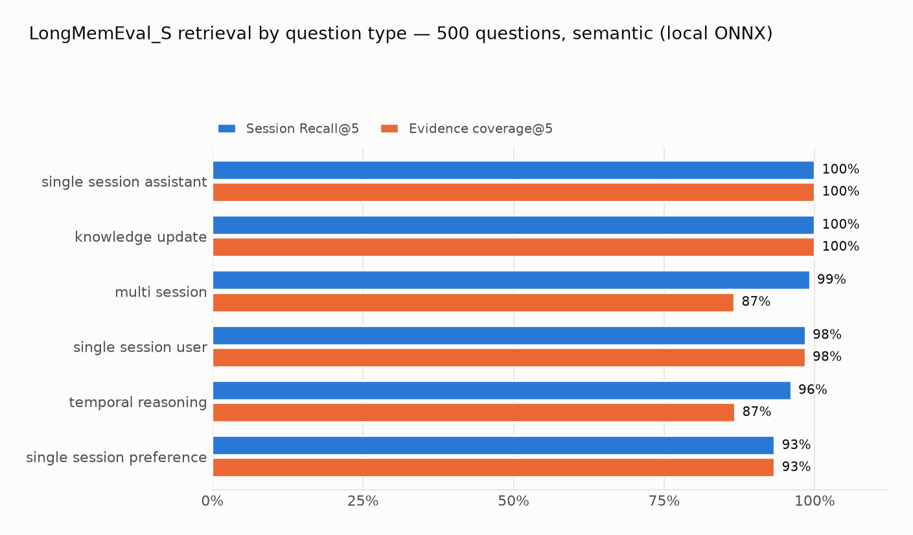
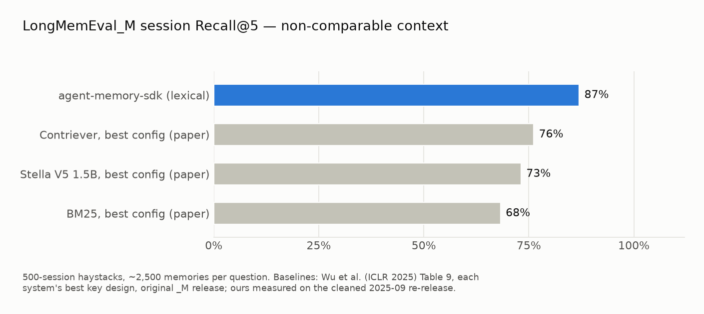
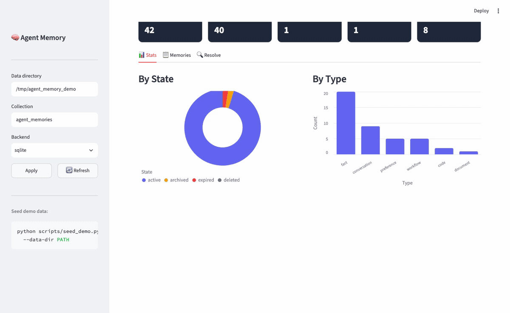
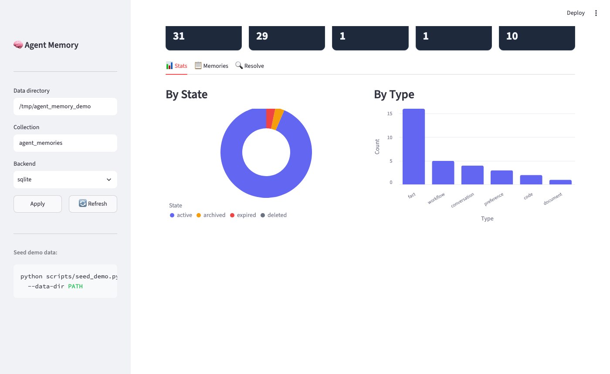
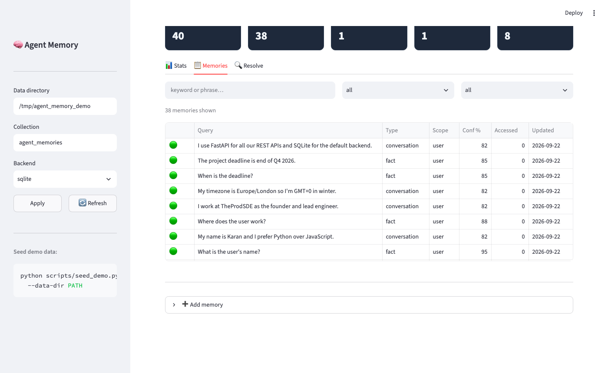
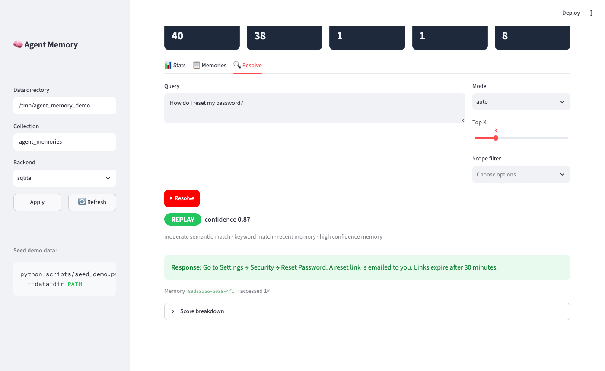
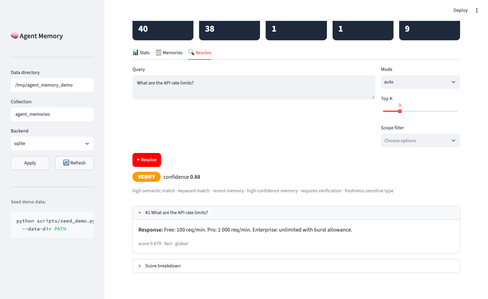

# Agent Memory

[](https://github.com/TheProdSDE/agent-memory-sdk/actions)
[](https://www.python.org/downloads/)
[](https://opensource.org/licenses/MIT)
[](https://pypi.org/project/agent-memory-sdk/)
[](https://registry.modelcontextprotocol.io/servers/io.github.theprodsde/agent-memory)

**Persistent semantic memory for AI agents with intelligent decision-making.**


> **🚀 Created by:** [TheProdSDE](https://github.com/TheProdSDE)

---

## The problem

Most AI memory systems retrieve and inject past context into every prompt.
This leads to wasted tokens, inconsistent responses, and agents that blindly
replay stale or wrong answers.

Agent Memory adds a **decision layer**:


Every `resolve()` returns an **explicit action** with a scored, explainable rationale —
not just a retrieved chunk.
Adversarial eval: **34/36 (94%)** on trap queries — the 2 misses return VERIFY (cautious), never a wrong REPLAY — see [benchmarks](docs/benchmarks.md).

---

## Context rot — what this solves (and what it can't)

**Context rot** is the measured degradation of LLM accuracy as the context window fills —
long before the token limit. Stale chunks, irrelevant retrievals, and unbounded conversation
history don't just waste tokens; they actively degrade answers ("lost in the middle",
instruction drift, distractor sensitivity).

Context rot has two causes. Agent Memory addresses the first; nothing outside the model
itself can address the second.

**1. What goes into the context — controllable, and this SDK's job:**

| Rot source | Mechanism in Agent Memory |
|-----------|---------------------------|
| Irrelevant memory injected into every prompt | Decision layer — **NONE** refuses to inject when nothing truly matches (34/36 on adversarial trap queries; the 2 misses fail safe to VERIFY) |
| Unbounded in-session history | **`PagedMemory`** — fixed in-context buffer; old turns page out to recall storage and return per-query (MemGPT-style tiers) |
| Instruction drift in long coding sessions | **RESTORE** re-injects the relevant convention fresh, near the end of context, exactly when a query needs it |
| Stale facts silently reused | **VERIFY** + custom verifier callbacks + TTL expiry + half-life temporal decay |
| Reminders that never adapt | `mark_correct()` / `mark_wrong()` — confidence learning promotes memories that keep helping, demotes corrected ones |
| Knowledge lost when the session ends | `from_conversation()` distills durable facts from conversation turns into the store |

**2. How the model attends over tokens already in its context — not controllable from outside.**
Attention degradation over long context is a property of the model. No memory layer changes
that. What Agent Memory does is keep the context small and relevant enough that the model
rarely enters the degraded regime in the first place.

**The honest claim:** Agent Memory prevents **context pollution** — the dominant
controllable cause of context rot in agentic systems. It doesn't change model attention
behavior, and it only helps if your agent routes context through `resolve()` /
`PagedMemory` instead of concatenating history by hand.

---

## How it compares

Today you need **three tools wired together** to get what `resolve()` does in one call:
a semantic cache (GPTCache) for replay, a memory layer (Mem0 / Zep) for context, and
custom staleness logic for verification. No existing tool decides — at read time —
*whether and how* a memory should be used.

| Capability | Mem0 | Zep / Graphiti | Letta (MemGPT) | GPTCache | **Agent Memory** |
|---|---|---|---|---|---|
| Read-time decision (replay / inject / verify / skip) | ❌ always injects | ❌ always injects | ⚠️ LLM self-manages | ⚠️ replay only | ✅ REPLAY / RESTORE / VERIFY / NONE |
| Explainable per-decision scores | ❌ | ❌ | ❌ | ❌ | ✅ `decision.explain()` |
| Semantic answer cache (skip the LLM call) | ❌ | ❌ | ❌ | ✅ | ✅ |
| Staleness protection at read time | ⚠️ write-side updates | ✅ temporal graph | ❌ | ⚠️ eviction only | ✅ VERIFY + TTL + confidence decay |
| Adversarial trap-query eval published | ❌ | ❌ | ❌ | ❌ | ✅ 34/36 (94%) |
| LLM / API calls per memory op | 1+ | 1+ | 1+ | 0 | **0** |
| Local after model assets are installed/cached, zero API keys | ❌ cloud-first | ⚠️ needs server + LLM | ⚠️ LLM per op | ✅ | ✅ SQLite + local ONNX |
| Paged context tiers (MemGPT-style) | ❌ | ❌ | ✅ | ❌ | ✅ `memory.paged()` |

Because hosted or model-backed configurations can add an LLM or embedding API
round-trip per memory operation, their latency includes provider, model, and
network costs. Exact latency depends on each project's configuration; this
repository does not publish a universal 100ms–2s floor. Agent Memory resolves
in-process in SQLite-only mode; measured latency depends on corpus shape and
cache state (see [performance](#performance) and [stress-testing details](docs/stress-testing.md)).

On *retrieval*, we publish a cleaned-release retrieval-proxy measurement below.
On *end-to-end accuracy* (LLM answering + judge, where Mem0 and Zep publish),
we don't quote numbers we haven't measured yet — that stage is
[next on the roadmap](benchmarks/longmemeval/REPORT.md#roadmap).
→ Full feature matrix and trade-offs (including where they're better): **[docs/comparison.md](docs/comparison.md)**

### Benchmarked on LongMemEval (ICLR 2025)

LongMemEval is a benchmark for conversational-history retrieval. These results
measure Agent Memory's RESTORE/retrieval tier, not REPLAY, VERIFY, TTL, or
end-to-end answer correctness. Each question runs against a separate SQLite
store containing that question's haystack; aggregate ingestion totals are not
the size of one queried store. All ingestion uses **zero LLM calls and $0 in API
charges**:

- **LongMemEval_S** (500 independent ~48-session haystacks; 124K turn-pair
  entries across all runs): **98.1% session Recall@5** with local ONNX
  embeddings, 96.0% lexical-only, 9.77ms lexical / 19.44ms semantic p50
  retrieval. The report includes p90/p95/p99 and run-resource measurements.

- **LongMemEval_M** (500 independent ~500-session haystacks; ~2,500 turn-pair
  entries per queried store): **87.0% session Recall@5** with lexical retrieval,
  12.10ms p50. This uses the official cleaned re-release and turn-pair indexing;
  it is not directly comparable with the paper's original-release session-index
  baselines.





Full methodology, per-type tables, scope notes (what this benchmark does and
doesn't test), and negative results are in the
**[benchmark report](benchmarks/longmemeval/REPORT.md)**. Reproduce the semantic
`_S` result with `uv run python benchmarks/longmemeval/run_retrieval.py --semantic`.

### Real software, not a prototype

Every claim below is reproducible from this repo:

- **34/36 (94%)** on adversarial decision-quality eval, and the 2 misses fail safe (VERIFY, never wrong REPLAY) — `agent-memory eval` ([methodology](docs/benchmarks.md))
- **LongMemEval retrieval proxy: 98.1% Recall@5 (_S, semantic) · 87.0% (_M, lexical)** — 500 independent haystacks; not an end-to-end or paper-baseline head-to-head, [full report](benchmarks/longmemeval/REPORT.md)
- **Reproducible stress harness** for synthetically seeded workloads up to 1,000,000 entries; archive the JSON output before publishing a performance claim ([methodology](docs/stress-testing.md))
- **Stress-test benchmark charts:** latency percentiles, seed throughput, resource use, action mix, and cache/decision rates for lexical FTS5 runs at 10K, 100K, and 1M entries, with workload and archived result JSON documented in [stress-testing](docs/stress-testing.md)
- **317 collected tests** across 21 test files — decision quality, concurrency, all 4 backends, MCP server, adapters — run in [CI](https://github.com/TheProdSDE/agent-memory-sdk/actions) on every push
- Published on [PyPI](https://pypi.org/project/agent-memory-sdk/) and the official [MCP Registry](https://registry.modelcontextprotocol.io/servers/io.github.theprodsde/agent-memory)
- Ships with a REST API, Streamlit dashboard, CLI, LangChain/LlamaIndex adapters, and async counterparts for memory read/write and decision operations

---

## When to use it — real use cases

| Use case | Without memory | With Agent Memory | Saving |
|----------|---------------|-------------------|--------|
| **Support bot** handling 10k identical FAQ queries/day | Every query costs 1 LLM call | If roughly 75% of requests match reusable memories, those matches can REPLAY without an LLM call | **Potentially lower LLM cost; measure your workload** |
| **Coding agent** that re-derives project conventions each session | Wastes 2–5 LLM calls per session to "remember" conventions | Conventions stored once are REPLAYED/RESTORED from the first query of every later session | **No re-derivation overhead** |
| **Research agent** building knowledge over multiple sessions | Each session starts cold; re-reads the same sources | Facts and summaries are RESTORED as context | **Persistent cross-session knowledge** |
| **Customer onboarding** bot answering the same steps repeatedly | Always generates a response | High-confidence workflows are REPLAYED verbatim | **Consistent identical answers** |
| **Tool-output caching** for expensive API calls | Calls the external API every time | Results stored with TTL; REPLAY within TTL, re-call after | **Reduced external API cost** |
| **Policy-compliance agent** that must verify facts before replaying | Silent hallucination risk on stale data | `requires_verification=True` ensures VERIFY fires; stale facts are never replayed silently | **Auditability + safety** |

### Where Agent Memory saves real money

A GPT-4o call costs ~$0.005. A support agent handling 50,000 queries/day with 70% repeat rate:
- Without memory: 50,000 × $0.005 = **$250/day**
- With Agent Memory: 15,000 LLM calls + cache misses = **$75/day**
- **Saving: ~ $175/day (~$64k/year)**
- Savings depend on your repeat rate and how similar incoming queries are to previously stored ones — measure in your own pipeline.

REPLAY avoids an LLM call when policy permits it. The latency and cost difference depends on the local workload, provider, model, and network; measure both paths in your own pipeline.

### Is it right for your use case?

**Good fit:**
- Agent answers the same or similar questions across sessions
- You have fact-sensitive answers that can go stale (prices, limits, policies)
- Multiple agents or services share a knowledge base
- You need audit trails — knowing *which* memory answered and why

**Not the right tool:**
- Document RAG over a corpus of files → use a vector database for that
- Replacing your application's source-of-truth database
- Agents that never repeat similar queries

---

## Features at a glance

| Feature | What it does |
|---------|-------------|
| **Decision engine** | Every `resolve()` returns REPLAY / RESTORE / VERIFY / NONE — never silent injection |
| **Explainability** | `decision.explain()` shows per-component scores: semantic, recency, confidence, usage |
| **Hybrid retrieval** | BM25 FTS5 + optional vector KNN + RRF fusion — fast and accurate |
| **4 backends** | SQLite (default, zero-setup) · ChromaDB · Redis · PostgreSQL |
| **Framework adapters** | Drop-in `BaseMemory` for LangChain and LlamaIndex |
| **MCP server** | Works with Cursor, Claude Code, VS Code via Model Context Protocol |
| **REST API** | FastAPI server with 9 endpoints + Swagger UI |
| **Dashboard** | Streamlit UI — stats, memory browser, live resolve sandbox |
| **Multi-agent** | SHARED / NAMESPACED / ISOLATED memory across multiple agents |
| **Confidence learning** | Event-driven confidence updates + half-life temporal decay |
| **Memory graph** | Relationship edges, path-finding, clusters, PageRank importance |
| **Paged context** | MemGPT-style tiers: in-context buffer → recall → archival; bounded working set per query |
| **Conversation distillation** | `from_conversation()` auto-extracts facts, preferences, and entities from turns |
| **Async API** | `aremember`, `aresolve`, `alist`, … — memory read/write and decision operations have async counterparts |
| **TTL & states** | Automatic expiry, archiving, near-duplicate consolidation |

→ Full feature reference: **[docs/features.md](docs/features.md)**

---

## Performance

Latency, CPU, and memory use depend on the corpus, query distribution, cache
state, embedding mode, machine, and operating system. The bundled harness uses
a repeatable synthetic workload; it does not establish a production SLA.

The current lexical FTS5 benchmark results and charts are archived with their source JSON
in [the stress-test methodology](docs/stress-testing.md). See that document for
commands, workload scope, and guidance on interpreting results.

---

## When to use it

**Use Agent Memory when:**
- You want an agent to remember past interactions without injecting all of them into every prompt
- You need explicit control over *when* memory is used (replay exact answers vs inject as context vs verify first)
- You have different memory trust levels (user preferences vs potentially-stale facts vs tool outputs)
- Multiple processes, services, or agents share the same memory store
- You need audit trails — every replay is traceable to a specific stored entry with a score breakdown

**Don't use it for:**
- Document RAG (search over a corpus of files) — use a vector database for that; Agent Memory stores query→answer *experiences*
- A replacement for your database — it stores transient agent knowledge, not your application's source-of-truth data

---

## Quick Start

```bash
pip install agent-memory-sdk
```

```python
from agent_memory import Memory, MemoryAction

memory = Memory(persist_dir=".agent_memory")

# Store once after a good answer
memory.remember(
    "How do I reset my password?",
    "Go to Settings → Security → Reset Password.",
    type="conversation", tags=["auth"],
)

# Decide before every LLM call
decision = memory.resolve("How do I reset my password?")

if decision.action == MemoryAction.REPLAY:
    return decision.response          # exact match — no LLM call needed

if decision.action == MemoryAction.RESTORE:
    context = memory.format_restore_context(decision)
    return call_llm(query, system_extra=context)

# VERIFY or NONE — validate or answer fresh
```

→ Full integration pattern and API reference: **[docs/usage.md](docs/usage.md)**

---

## Local Setup

### Option 1 — SQLite (zero dependencies, recommended to start)

```bash
pip install agent-memory-sdk

# Store something
agent-memory remember "How do I reset my password?" \
  "Go to Settings → Security → Reset Password." \
  --type conversation --tags auth,faq

# Ask the exact question back → REPLAY (no LLM call needed)
agent-memory resolve "How do I reset my password?"
# ✅ REPLAY   confidence: 0.88
# response: Go to Settings → Security → Reset Password.

# Ask a paraphrase → RESTORE (inject as context, don't answer verbatim)
agent-memory resolve "I forgot my password"
# 📋 RESTORE  confidence: 0.77
# [1] score=0.77  How do I reset my password? → Go to Settings → …

# See what's stored
agent-memory stats
```

### Option 2 — Redis or Postgres backend

```bash
# Spin up the services
docker compose -f docker-compose.dev.yml up -d

# Install the backend extra
pip install "agent-memory-sdk[redis]"      # or [postgres]

# Use it
agent-memory --backend redis remember "API limit" "1000 req/min" --type fact
agent-memory --backend redis resolve "What is the rate limit?"
```

### Option 3 — Streamlit dashboard (visual exploration)

```bash
pip install "agent-memory-sdk[dashboard]"

# Seed demo data (optional)
python scripts/seed_demo.py --data-dir .agent_memory

# Open the dashboard
AGENT_MEMORY_DIR=.agent_memory agent-memory-dashboard
# → http://localhost:8501
```

### Option 4 — Development / from source

```bash
git clone https://github.com/TheProdSDE/agent-memory-sdk.git
cd agent-memory-sdk
python -m venv .venv && source .venv/bin/activate
pip install -e ".[dev]"
make test          # run all tests
make check         # lint + type check
```

---

## Dashboard

An interactive Streamlit dashboard for exploring memories, testing the resolve sandbox, and monitoring stats.



| Stats — KPIs + charts | Memories — searchable table |
|---|---|
|  |  |

| Resolve → REPLAY | Resolve → VERIFY |
|---|---|
|  |  |

```bash
pip install "agent-memory-sdk[dashboard]"
AGENT_MEMORY_DIR=.agent_memory agent-memory-dashboard   # → http://localhost:8501

# Seed demo data (optional — run only when you want it)
python scripts/seed_demo.py --data-dir .agent_memory
```

---

## MCP Server

Agent Memory is published on the [MCP Registry](https://registry.modelcontextprotocol.io/servers/io.github.theprodsde/agent-memory) — install it in any MCP-compatible client with zero manual setup.

### Add to your MCP client

**Cursor** — add to `.cursor/mcp.json` in your project, or `~/.cursor/mcp.json` globally:

```json
{
  "mcpServers": {
    "agent-memory": {
      "command": "uvx",
      "args": ["agent-memory-sdk"]
    }
  }
}
```

**Claude Desktop** — add to `~/Library/Application Support/Claude/claude_desktop_config.json` (macOS) or `%APPDATA%\Claude\claude_desktop_config.json` (Windows):

```json
{
  "mcpServers": {
    "agent-memory": {
      "command": "uvx",
      "args": ["agent-memory-sdk"]
    }
  }
}
```

**Claude Code** — add to `.claude/settings.json` in your project:

```json
{
  "mcpServers": {
    "agent-memory": {
      "command": "uvx",
      "args": ["agent-memory-sdk"]
    }
  }
}
```

`uvx` installs the package on first run — no `pip install` needed.

### Custom storage location

```json
{
  "mcpServers": {
    "agent-memory": {
      "command": "uvx",
      "args": ["agent-memory-sdk"],
      "env": {
        "AGENT_MEMORY_DIR": "/path/to/your/memory",
        "AGENT_MEMORY_COLLECTION": "my_project"
      }
    }
  }
}
```

| Variable | Default | Description |
|----------|---------|-------------|
| `AGENT_MEMORY_DIR` | `~/.agent_memory` | Directory for the persistent SQLite store |
| `AGENT_MEMORY_COLLECTION` | `agent_memories` | Collection name (one DB per collection) |

### Tools exposed

| Tool | What it does |
|------|-------------|
| `resolve_memory` | Retrieve memory and get an explicit decision: **replay** / **restore** / **verify** / **none** — with confidence score and reasoning |
| `remember_memory` | Store a query/response pair with optional tags, type, scope, confidence, TTL |
| `list_memories` | Paginated list of stored memories with scope and archive filters |
| `get_memory_by_id` | Fetch a single memory entry by ID |
| `forget_memory` | Permanently delete a memory |
| `archive_memory` | Archive a memory (excluded from retrieval, not deleted) |
| `consolidate_memories` | Merge near-duplicate memories into summary entries |

→ Full MCP setup guide and Docker config: **[docs/mcp.md](docs/mcp.md)**

---

## Integrations

`agent-memory-sdk` is the core — every integration delegates to `Memory`.

| Integration | Install extra | Example |
|-------------|--------------|---------|
| **Core SDK** (SQLite) | *(none)* | [basic_usage.py](examples/basic_usage.py) |
| **LangChain** `BaseMemory` | `[langchain]` | [langchain_integration.py](examples/langchain_integration.py) |
| **LlamaIndex** `BaseMemory` | `[llamaindex]` | [llamaindex_integration.py](examples/llamaindex_integration.py) |
| **Redis** backend | `[redis]` | [redis_backend.py](examples/redis_backend.py) |
| **PostgreSQL** backend | `[postgres]` | [postgres_backend.py](examples/postgres_backend.py) |
| **Multi-agent** isolation | *(none)* | [multi_agent.py](examples/multi_agent.py) |
| **FastAPI** REST server | `[api]` | [rest_api.py](examples/rest_api.py) |
| **Confidence + Graph** | *(none)* | [confidence_and_graph.py](examples/confidence_and_graph.py) |
| **Benchmark harness** | *(none)* | [benchmark_harness.py](examples/benchmark_harness.py) |

→ Setup instructions and code snippets for each: **[examples/README.md](examples/README.md)**

---

## Tech Stack

| Component | Technology |
|-----------|------------|
| **Language** | Python 3.10+ |
| **Storage** | SQLite · ChromaDB · Redis · PostgreSQL |
| **Retrieval** | BM25 FTS5 + Vector KNN + RRF fusion |
| **Interfaces** | MCP · FastAPI · Streamlit · CLI |
| **Adapters** | LangChain `BaseMemory` · LlamaIndex `BaseMemory` |
| **Search DSA** | Bloom filter (NONE fast-path) · Dynamic IDF stop words · RRF fusion |
| **Testing** | pytest (317 collected tests) · ruff · mypy |
| **CI/CD** | GitHub Actions — test matrix 3.10–3.13 → release gate → PyPI |

No API keys required — everything runs locally.

---

## Documentation

| Doc | Contents |
|-----|----------|
| [docs/usage.md](docs/usage.md) | Integration pattern, API reference, MemoryEntry / MemoryDecision fields |
| [docs/features.md](docs/features.md) | Decision actions, hybrid retrieval, types, scopes, TTL, graph, multi-agent |
| [docs/mcp.md](docs/mcp.md) | MCP server setup for Cursor, Claude Code, VS Code; Docker config |
| [docs/cli.md](docs/cli.md) | CLI commands, REST API server, dashboard launch, eval dataset format |
| [docs/roadmap.md](docs/roadmap.md) | All shipped features, what's next, GitHub Project board |
| [docs/release.md](docs/release.md) | CI-automated release process, versioning, rollback |
| [docs/architecture.md](docs/architecture.md) | Retrieval pipeline, scoring policy, system design |
| [docs/comparison.md](docs/comparison.md) | Feature matrix vs Redis, mem0, Zep, LangMem, LlamaIndex, MemGPT |
| [docs/stress-testing.md](docs/stress-testing.md) | 10K / 100K / 1M latency benchmarks with methodology |
| [docs/benchmarks.md](docs/benchmarks.md) | Eval results and reproduce commands |
| [docs/why-decision-layer.md](docs/why-decision-layer.md) | The failure mode this project exists to fix |
| [examples/README.md](examples/README.md) | Index of all runnable examples |
| [CONTRIBUTING.md](CONTRIBUTING.md) | Dev setup, test commands, PR checklist |

---

## Status & Roadmap

All planned features through v0.5.0 are **shipped**.
Track what's next on the **[GitHub Project →](https://github.com/users/theprodsde/projects/2)**

→ **[docs/roadmap.md](docs/roadmap.md)**

## Release

Tag-triggered, fully CI-gated: `git tag v0.x.y && git push origin v0.x.y`

→ **[docs/release.md](docs/release.md)**

---

## Contributing

See **[CONTRIBUTING.md](CONTRIBUTING.md)** for dev setup, test commands, and the PR checklist.

---

## License

MIT — see [LICENSE](LICENSE).

---

## Support

- **Issues:** [GitHub Issues](https://github.com/TheProdSDE/agent-memory-sdk/issues)
- **Discussions:** [GitHub Discussions](https://github.com/TheProdSDE/agent-memory-sdk/discussions)
- **Email:** theprodsde@gmail.com

---

> **Agent Memory helps agents decide: Replay → Restore → Verify → Ignore**
>
> Built with ❤️ by [TheProdSDE](https://github.com/TheProdSDE)

mcp-name: io.github.theprodsde/agent-memory
