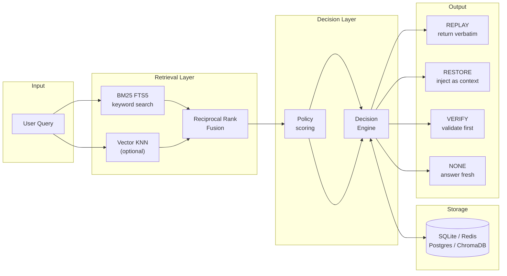

# Architecture

## Overview

agent-memory-sdk is a **decision layer** that sits between user queries and LLM calls. Rather than always injecting past context, it evaluates each query against stored memories and returns an explicit action with a scored rationale.



---

## Module map

| Module | Responsibility | Key class |
|--------|---------------|-----------|
| `store.py` | Abstract backend interface | `MemoryStore` (ABC) |
| `sqlite_store.py` | SQLite + FTS5 + optional sqlite-vec | `SqliteMemoryStore` |
| `redis_store.py` | Redis backend (JSON + sorted-set index) | `RedisMemoryStore` |
| `postgres_store.py` | Postgres + tsvector + optional pgvector | `PostgresMemoryStore` |
| `retriever.py` | Hybrid BM25 + vector → RRF fusion + cache | `MemoryRetriever`, `FusionStrategy` |
| `policy.py` | Multi-factor scoring | `DefaultPolicy`, `DecisionPolicy` (ABC) |
| `decision.py` | Action selection and logging | `DecisionEngine` |
| `explain.py` | Score enrichment and text formatting | `enrich_decision`, `format_explanation` |
| `manager.py` | Public SDK facade | `Memory` |
| `models.py` | Pydantic data models | `MemoryEntry`, `MemoryDecision` |
| `confidence.py` | Adaptive confidence updates | `ConfidenceLearner` |
| `graph.py` | Similarity-based memory graph | `MemoryGraph` |
| `knowledge_graph.py` | Typed entity + relation graph | `KnowledgeGraph`, `GraphBuilder` |
| `entity_extractor.py` | Auto-extract memories from conversation | `EntityExtractor` |
| `paged_memory.py` | Hierarchical context tiers | `PagedMemory` |
| `multiagent.py` | Multi-agent memory isolation | `MultiAgentMemory` |
| `exceptions.py` | Domain exception hierarchy | `AgentMemoryError` |
| `logging_config.py` | Package-wide structured logging | `get_logger`, `timed` |

---

## Retrieval pipeline

### Step 1 — Parallel search

Both searches run against the same store. On SQLite without embeddings, the semantic path is a no-op (deduplicated in the retriever).

```
keyword_search(query, top_k=top_k*2)   →  [(entry, bm25_score), …]
vector_search(query,  top_k=top_k*2)   →  [(entry, cosine_sim), …]
```

**SQLite FTS5** computes BM25 in SQL, scaled by query-term coverage to penalise weak single-word matches. Runtime ≈ 2ms at 5k entries.

### Step 2 — Reciprocal Rank Fusion

RRF merges the two lists without assuming their scores are on the same scale:

```
rrf_score(d) = Σ  1 / (k + rank_i(d))     k=60 (empirically strong default)
```

Configurable via `FusionStrategy` — swap in `LinearFusionStrategy` or a custom reranker without touching `MemoryRetriever`.

### Step 3 — Policy scoring

Each fused entry is scored by `DefaultPolicy`:

```
policy_score = 0.55 × hybrid_semantic
             + 0.15 × recency
             + 0.20 × confidence
             + 0.10 × usage_capped
```

Recency uses a half-life model: `exp(-ln2 × age_days / 30)`. A shared `datetime.now()` is passed across all entries in a batch (DP optimisation).

### Step 4 — Decision

| Condition | Action |
|-----------|--------|
| `requires_verification=True` and score ≥ restore_threshold | VERIFY |
| score ≥ replay_threshold (default 0.85) | REPLAY |
| score ≥ restore_threshold (default 0.70) | RESTORE or VERIFY |
| score < restore_threshold | NONE |

---

## Caching

The retriever maintains an in-process LRU cache (256 entries, 5s TTL). Cache hits return in < 0.1ms. The cache is invalidated on every write via `invalidate_cache()`.

```
cache miss → SQLite → p95 ≈ 5.8ms  (at 100k entries)
cache hit  → RAM    → p50 ≈ 0.05ms
```

---

## Storage backends

All backends implement `MemoryStore` (ABC). They are interchangeable — the retrieval, policy, and decision layers are backend-agnostic.

| Backend | Keyword search | Vector search | Notes |
|---------|---------------|--------------|-------|
| SQLite | FTS5 BM25 + coverage | sqlite-vec KNN (optional) | Default; WAL mode; thread-local conn cache |
| ChromaDB | Python BM25 | Chroma built-in | For existing ChromaDB deployments |
| Redis | Python BM25 | — | Sub-ms reads; no persistence by default |
| PostgreSQL | tsvector GIN | pgvector (optional) | Production SQL; SQL aggregates |

---

## SOLID compliance

| Principle | Where |
|-----------|-------|
| **S** — Single Responsibility | `KnowledgeGraph` only stores+queries; `GraphBuilder` builds; `PatternExtractionStrategy` extracts |
| **O** — Open/Closed | New backends extend `MemoryStore`; new fusion algorithms extend `FusionStrategy`; new extractors extend `EntityExtractionStrategy` |
| **L** — Liskov Substitution | Any `MemoryStore` / `FusionStrategy` / `EntityExtractionStrategy` is substitutable |
| **I** — Interface Segregation | `MemoryStore` ABC defines only what backends must implement; `DecisionPolicy` ABC separates scoring from selection |
| **D** — Dependency Inversion | `MemoryRetriever` depends on `FusionStrategy` (abstract); `GraphBuilder` depends on `EntityExtractionStrategy` (abstract) |
