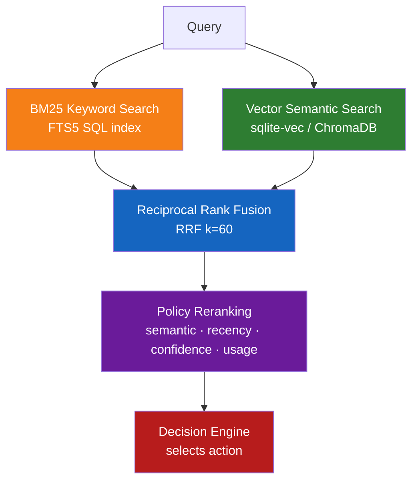

# Features

## Decision-Based Memory

Memory is **not automatically injected**. Every `resolve()` returns one of four explicit actions:

| Action | Behaviour | When it fires |
|--------|-----------|---------------|
| **REPLAY** | Return the stored answer verbatim | Exact or near-identical query with high confidence |
| **RESTORE** | Inject memory as LLM context | Similar query that needs adaptation |
| **VERIFY** | Flag for validation before reuse | Facts, workflows, tool outputs — or stale entries |
| **NONE** | Ignore memory entirely | Unrelated query; memory stays out of the way |

```python
decision = memory.resolve("How do I reset my password?")
# decision.action  → MemoryAction.REPLAY
# decision.confidence → 0.92
# decision.response   → "Go to Settings → Security → Reset Password."
print(decision.explain())  # per-component score breakdown
```

---

## Hybrid Retrieval Pipeline



**Policy weight defaults** (customisable — see [Policies](policies.md)):

| Factor | Weight | Note |
|--------|--------|------|
| Semantic + keyword similarity | 55% | Combined BM25 + vector score |
| Confidence | 20% | Set at `remember()` time; updated by `ConfidenceLearner` |
| Recency | 15% | Exponential decay, half-life 30 days |
| Usage frequency | 10% | Access count incentive |

---

## Storage Backends

| Backend | Extra | Retrieval | Best for |
|---------|-------|-----------|----------|
| `sqlite` *(default)* | *(none)* | FTS5 BM25 + coverage scaling | Zero-setup, fast, no server |
| `sqlite` + vectors | `[semantic]` | sqlite-vec KNN + FTS5 hybrid | Paraphrase robustness without a server |
| `chromadb` | *(bundled)* | Vector embeddings + Python BM25 | Existing ChromaDB deployments |
| `redis` | `[redis]` | Python BM25 (sorted-set index) | Sub-millisecond reads, shared state |
| `postgres` | `[postgres]` | tsvector FTS + optional pgvector | Production SQL databases |

Start Redis + Postgres locally:

```bash
docker compose -f docker-compose.dev.yml up -d
```

> **Honesty note:** Without `[semantic]`, sqlite's search is lexical. Paraphrases with no shared words
> need `[semantic]` or `chromadb`.

---

## Memory Types & Scopes

**Types** control how the decision engine treats a memory:

| Type | Behaviour |
|------|-----------|
| `conversation` | Standard replay/restore |
| `fact` | Triggers VERIFY when confidence drops or memory ages |
| `workflow` | Triggers VERIFY when stale |
| `tool_output` | Triggers VERIFY; pair with `ttl=` for automatic expiry |
| `document` | Long-form content, always RESTORE |
| `code` | Code snippets |
| `summary` | Consolidated memory (created by `consolidate()`) |
| `preference` | User settings, high replay priority |

**Scopes** isolate memories:

`session` · `user` · `project` · `workspace` · `team` · `global`

```python
memory.remember(query, response, type="fact", scope="project")
entries = memory.list(scope=["user", "global"])
decision = memory.resolve(query, scope=["user", "global"])
```

---

## Time-to-Live (TTL)

```python
memory.remember(query, response, ttl="30d")   # expires after 30 days
memory.remember(query, response, ttl="2h")    # expires after 2 hours
memory.remember(query, response, ttl=3600)    # expires after 3600 seconds

memory.cleanup()           # mark expired entries as expired
memory.cleanup(delete=True)  # permanently delete them
```

---

## Confidence Learning

Confidence tracks how much to trust a memory. It starts at `1.0` and updates via feedback events:

```python
from agent_memory import ConfidenceLearner, ConfidenceEvent

learner = ConfidenceLearner()
update = learner.record_event(entry, ConfidenceEvent.VERIFIED_INCORRECT)
# entry.confidence lowered by 0.20
memory.store.update(entry)

# Nightly temporal decay (half-life 90 days)
for e in memory.list():
    learner.decay(e)
    memory.store.update(e)
```

Events: `ACCESSED` · `VERIFIED_CORRECT` · `VERIFIED_INCORRECT` · `USER_CONFIRMED` · `USER_REJECTED` · `STALE`

---

## Memory Graph

Discover relationships between stored memories:

```python
from agent_memory import MemoryGraph

graph = MemoryGraph.build(memory.store, similarity_threshold=0.4)
neighbours = graph.neighbors(entry_id, min_weight=0.5)
path      = graph.path(source_id, target_id)    # BFS shortest path
clusters  = graph.clusters(min_weight=0.4)       # connected components
scores    = graph.importance_scores()            # PageRank
export    = graph.to_dict()                      # JSON for d3.js / Gephi
```

---

## Multi-Agent Support

Multiple agents share one store with configurable isolation:

| Mode | `list()` returns | Use case |
|------|-----------------|---------|
| `NAMESPACED` *(default)* | own + global | Most agent setups |
| `ISOLATED` | own only | Strict per-agent privacy |
| `SHARED` | everything | Admin / monitoring agents |

```python
from agent_memory import Memory, MultiAgentMemory
from agent_memory.multiagent import IsolationMode

shared = Memory(persist_dir=".agent_memory")
agent  = MultiAgentMemory(shared, agent_id="support", isolation=IsolationMode.NAMESPACED)

agent.broadcast("company name", "Acme Corp")        # visible to all agents
agent.transfer_memory(entry_id, "another-agent")    # transfer ownership
```

---

## Observability

```python
decision = memory.resolve(query)

decision.action        # REPLAY | RESTORE | VERIFY | NONE
decision.confidence    # 0.0–1.0
decision.reasons       # ["high semantic match", "recent memory", …]
decision.scores        # {"semantic": 0.91, "recency": 0.85, …}

print(decision.explain())   # full human-readable score breakdown
```

---

## Consolidation

Merge near-duplicate memories into summaries:

```python
created = memory.consolidate(similarity_threshold=0.95)
# Archived the originals, returned new SUMMARY entries
```

---

## Paged Context (Hierarchical Memory)

MemGPT/Letta-style context tiers that keep in-session context bounded instead of
growing until it rots. Recent turns live in a fixed-size in-context buffer; when
the buffer fills, the oldest turns page out to recall storage and come back only
when a query semantically matches them. Archived entries form a third, cold tier
searched on explicit request.

```python
paged = memory.paged(context_size=20, recall_top_k=5)

# Add turns — old entries page out to recall automatically
paged.add_turn("What is Python?", "A programming language.")
paged.add_turn("Favourite framework?", "FastAPI.")

# Bounded, query-relevant context for the next LLM call
ctx = paged.get_context("Tell me about Python")
prompt_block = ctx.format_for_llm()   # in-context buffer + matching recall entries

paged.search_archive("Python version history")  # explicit cold-tier search
paged.flush_to_recall()                          # page everything out at session end
```

---

## Conversation Distillation

Extract durable facts, preferences, and entities from a conversation turn and store
them automatically — so knowledge survives the session instead of dying with the
context window. Only candidates above `min_confidence` are stored.

```python
entries = memory.from_conversation(
    human="My name is Karan and I prefer Python.",
    assistant="Got it!",
)
# → stored entries for the name and the language preference,
#   each typed, tagged, and confidence-scored by the EntityExtractor
```
