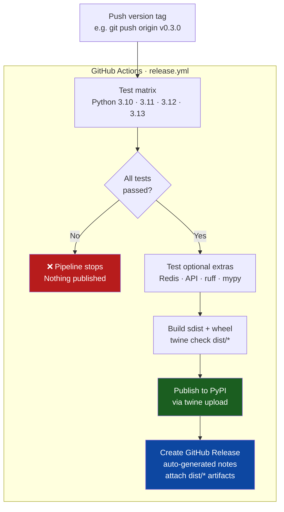

# Release Process

Releases are **fully automated by CI** — you push a version tag, tests run, and if they pass the package is published to PyPI and a GitHub Release is created. Nothing is published manually.

## How it works



## Create a release

```bash
# Make sure you are on main with all changes merged
git checkout main && git pull origin main

# Tag the release (this is the only manual step)
git tag v0.3.0
git push origin v0.3.0

# Watch CI at:
# https://github.com/TheProdSDE/agent-memory-sdk/actions
```

The pipeline runs the full test matrix (3.10–3.13) and the extras test before it touches PyPI.
If any job fails the tag exists but nothing is published — fix the failure and delete then re-push the tag.

## Version format (Semantic Versioning)

| Tag | Type |
|-----|------|
| `v1.0.0` | Stable release |
| `v1.1.0` | Minor release (new features, no breaking changes) |
| `v1.0.1` | Patch release (bug fix) |
| `v2.0.0` | Major release (breaking change) |
| `v1.0.0-alpha.1` | Alpha pre-release (auto-flagged on GitHub) |
| `v1.0.0-beta.2` | Beta pre-release |
| `v1.0.0-rc.1` | Release candidate |

Pre-release tags (`-alpha`, `-beta`, `-rc`) are automatically marked as pre-release on the GitHub Release page.

## Prerequisites

| Secret / permission | Where to set | Purpose |
|---------------------|-------------|---------|
| `PYPI_API_TOKEN` | Repo → Settings → Secrets | Authenticate to PyPI |
| `GITHUB_TOKEN` | Automatically provided | Create the GitHub Release |

## Rollback

```bash
# Delete the tag (stops any in-progress pipeline)
git tag -d v0.3.0
git push origin --delete v0.3.0

# Note: PyPI packages cannot be deleted — only yanked
twine yank agent-memory-sdk 0.3.0   # marks as deprecated, not removed
```

## What gets published

| Artifact | Location after release |
|----------|----------------------|
| PyPI wheel + sdist | `pip install agent-memory-sdk==0.3.0` |
| GitHub Release | https://github.com/TheProdSDE/agent-memory-sdk/releases |
| Release notes | Auto-generated from merged PRs / commits |
| Source archives | Attached to the GitHub Release |
