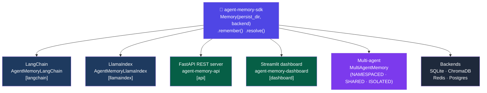

# Examples

Runnable code samples for every integration.
`agent-memory-sdk` is the central package in all of them — the adapters, servers, and framework connectors all delegate storage, retrieval, and decision logic to `Memory`.



---

## Index

| Example | Install extra | Run |
|---------|--------------|-----|
| [basic_usage.py](basic_usage.py) | *(none)* | `python examples/basic_usage.py` |
| [langchain_integration.py](langchain_integration.py) | `[langchain]` | `python examples/langchain_integration.py` |
| [llamaindex_integration.py](llamaindex_integration.py) | `[llamaindex]` | `python examples/llamaindex_integration.py` |
| [redis_backend.py](redis_backend.py) | `[redis]` | Needs Redis — see below |
| [postgres_backend.py](postgres_backend.py) | `[postgres]` | Needs Postgres — see below |
| [multi_agent.py](multi_agent.py) | *(none)* | `python examples/multi_agent.py` |
| [rest_api.py](rest_api.py) | `[api]` | Needs server — see below |
| [confidence_and_graph.py](confidence_and_graph.py) | *(none)* | `python examples/confidence_and_graph.py` |
| [benchmark_harness.py](benchmark_harness.py) | *(none)* | `python examples/benchmark_harness.py` |

---

## Setup

### Core (SQLite, no extras needed)

```bash
pip install agent-memory-sdk
python examples/basic_usage.py
python examples/multi_agent.py
python examples/confidence_and_graph.py
python examples/benchmark_harness.py
```

### LangChain adapter

```bash
pip install "agent-memory-sdk[langchain]" langchain-openai
python examples/langchain_integration.py
```

### LlamaIndex adapter

```bash
pip install "agent-memory-sdk[llamaindex]" llama-index-llms-openai
python examples/llamaindex_integration.py
```

### Redis backend

```bash
# Start Redis (or use docker-compose.dev.yml)
docker compose -f docker-compose.dev.yml up -d redis

pip install "agent-memory-sdk[redis]"
python examples/redis_backend.py
```

### PostgreSQL backend

```bash
# Start Postgres
docker compose -f docker-compose.dev.yml up -d postgres

pip install "agent-memory-sdk[postgres]"
python examples/postgres_backend.py
```

### REST API server

```bash
pip install "agent-memory-sdk[api]"

# Terminal 1 — start the server
AGENT_MEMORY_DIR=.agent_memory agent-memory-api

# Terminal 2 — run the client example
python examples/rest_api.py
```

---

## Example descriptions

### [basic_usage.py](basic_usage.py)
The fundamentals: `remember()`, `resolve()`, all four actions (REPLAY / RESTORE / VERIFY / NONE), and `decision.explain()`.
No extras needed.

---

### [langchain_integration.py](langchain_integration.py)
Drops `AgentMemoryLangChain` into a LangChain `ConversationChain` as a `BaseMemory` replacement.

- `save_context()` → `memory.remember()`
- `load_memory_variables()` → `memory.resolve()` — returns plain text or `list[BaseMessage]`
- Plugs into any chain with `memory=lc_memory`

```python
from agent_memory import Memory
from agent_memory.adapters.langchain_adapter import AgentMemoryLangChain

memory = Memory(persist_dir=".agent_memory")
lc_memory = AgentMemoryLangChain(memory=memory, return_messages=False)

lc_memory.save_context({"input": "What is the rate limit?"}, {"output": "100 req/min."})
ctx = lc_memory.load_memory_variables({"input": "API limits?"})
print(ctx["history"])
```

---

### [llamaindex_integration.py](llamaindex_integration.py)
Wraps `Memory` as a LlamaIndex `BaseMemory` for chat engines and OpenAI agents.

- `put()` buffers messages; flushes USER+ASSISTANT pairs to persistent memory automatically
- `get(input=)` retrieves relevant context via `memory.resolve()`
- `token_limit` trims context to fit your LLM's window
- Plugs into `OpenAIAgent.from_tools(..., memory=li_memory)`

```python
from agent_memory import Memory
from agent_memory.adapters.llamaindex_adapter import AgentMemoryLlamaIndex

memory = Memory(persist_dir=".agent_memory")
li_memory = AgentMemoryLlamaIndex(memory=memory, top_k=5)

msgs = li_memory.get(input="API rate limits?")
```

---

### [redis_backend.py](redis_backend.py)
Uses Redis as the storage engine instead of SQLite. Identical API — only the constructor changes.

- Sub-millisecond reads for frequently accessed memories
- Keys namespaced under a configurable prefix
- BM25 keyword search (Python-side, no Redis module required)

```python
from agent_memory import Memory

memory = Memory(backend="redis", url="redis://localhost:6379/0")
memory.remember("password reset", "Settings → Security → Reset Password.")
d = memory.resolve("I forgot my password")
```

---

### [postgres_backend.py](postgres_backend.py)
Uses PostgreSQL with `tsvector` full-text search. Scope-aware queries map cleanly to SQL WHERE clauses.

- `tsvector` GIN index for fast keyword search
- Optional pgvector KNN for semantic search (install `[pgvector]`)
- Scope filtering pushed to SQL — no Python-side filtering

```python
from agent_memory import Memory, MemoryScope

memory = Memory(backend="postgres", dsn="postgresql://user:pw@localhost/mydb")
memory.remember("deadline", "Ships Friday", scope=MemoryScope.PROJECT)
d = memory.resolve("When is the deadline?", scope=[MemoryScope.PROJECT])
```

---

### [multi_agent.py](multi_agent.py)
Multiple agents share one `Memory` store with configurable isolation.

| Mode | `list()` returns | `resolve()` searches |
|------|-----------------|---------------------|
| `NAMESPACED` (default) | own + global | full store |
| `ISOLATED` | own only | full store |
| `SHARED` | everything | full store |

> **Note:** `resolve()` always searches the full store. Use `scope=` to narrow it,
> or use `list()` + `store.keyword_search()` for fully isolated retrieval.

```python
from agent_memory import Memory, MultiAgentMemory

shared = Memory(persist_dir=".agent_memory")
agent_a = MultiAgentMemory(shared, agent_id="agent-a")
agent_b = MultiAgentMemory(shared, agent_id="agent-b")

agent_a.remember("secret", "only a's data")
agent_b.broadcast("company name", "Acme Corp")   # visible to all

print(agent_a.list())   # sees: agent-a's memories + broadcasts
print(agent_b.list())   # sees: agent-b's memories + broadcasts
```

---

### [rest_api.py](rest_api.py)
Two patterns: calling the REST server with `httpx`, and embedding it inside your own FastAPI app.

```python
# Call the running server
import httpx
client = httpx.Client(base_url="http://localhost:8000")
client.post("/memories", json={"query": "...", "response": "..."})
data = client.post("/resolve", json={"query": "..."}).json()

# Or embed in your own app
from fastapi import FastAPI
from agent_memory.api.server import create_app

app = FastAPI()
app.mount("/memory", create_app(persist_dir=".agent_memory"))
```

Full endpoint list: `POST /memories`, `GET /memories`, `GET /memories/{id}`,
`DELETE /memories/{id}`, `POST /memories/{id}/archive`, `POST /resolve`,
`GET /stats`, `POST /cleanup`, `POST /consolidate`.

---

### [confidence_and_graph.py](confidence_and_graph.py)
Two advanced features that build on the core `Memory` store.

**Confidence learning** — update confidence based on feedback events:

```python
from agent_memory import ConfidenceLearner, ConfidenceEvent

learner = ConfidenceLearner()
update = learner.record_event(entry, ConfidenceEvent.USER_CONFIRMED)
# entry.confidence is updated in-place; persist with memory.store.update(entry)

# Nightly decay: half-life 90 days
for e in memory.list():
    learner.decay(e)
    memory.store.update(e)
```

**Memory graph** — discover relationships between memories:

```python
from agent_memory import MemoryGraph

graph = MemoryGraph.build(memory.store, similarity_threshold=0.4)
neighbours = graph.neighbors(entry_id)          # related by similarity or tags
path = graph.path(source_id, target_id)         # BFS shortest path
clusters = graph.clusters()                     # connected components
scores = graph.importance_scores()              # PageRank
```

---

### [benchmark_harness.py](benchmark_harness.py)
Measures retrieval quality using a LongMemEval- or LoCoMo-style dataset.

Metrics: **Recall@k**, **MRR**, **content recall**, **action accuracy**, **P95 latency**.

```python
from agent_memory import Memory, BenchmarkHarness, BenchmarkDataset

memory  = Memory(persist_dir=".agent_memory")
harness = BenchmarkHarness(memory)
result  = harness.run_from_file("my_dataset.json")
print(result.format())
```

Dataset format — `sessions` (events to seed) + `questions` (queries to evaluate):

```json
{
  "name": "my_bench",
  "sessions": [
    { "session_id": "s1", "events": [
      { "query": "Q", "response": "A", "type": "fact", "tags": ["topic"] }
    ]}
  ],
  "questions": [
    { "query": "related?", "expected_content": "A", "difficulty": "easy" }
  ]
}
```
